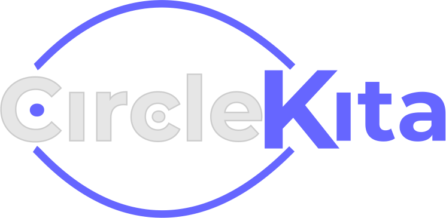
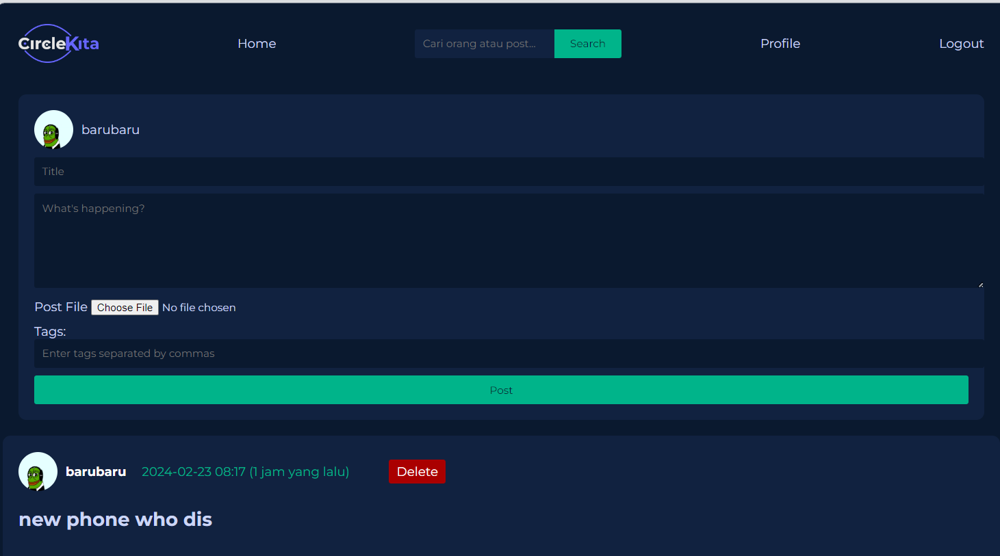

# CircleKita




Social Media platform for my Pair Project. Using a monolith architecture as I'm learning back end and front end web development. It enables users to interact, share content, upload image, liking posts, set up profiles and see other people's profile. This was Developed with NodeJS, ExpressJS, PostgreSQL, Sequelize, and EJS. And it utilizes bcrypt for user account's password encryption and session for authentication. it offers a user-friendly interface for users to engage with each other and discover interesting content.


# Getting Started
To install and use the CircleKita app, follow these steps:

Clone the repository:

```git bash
git clone https://github.com/raihank43/CircleKita.git
```

Install the required packages:

```git bash
npm install
```

Set up the PostgreSQL database:

```git bash
Install PostgreSQL if you haven't already.
Create a new database for CircleKita. (I personally use DBeaver)
```

Configure the database connection:

```git bash
Open the config/config.json file.
Update the development object with your PostgreSQL database credentials.
Run the migration and seeding files:
```

Run the migration and seeding files:
```git bash
npx sequelize-cli db:migrate
npx sequelize-cli db:seed:all
```

Start the application:

Access the app in your browser: Open your browser and navigate to http://localhost:3000.

Note: Make sure you have Node.js and npm installed on your machine before proceeding with the installation steps.





